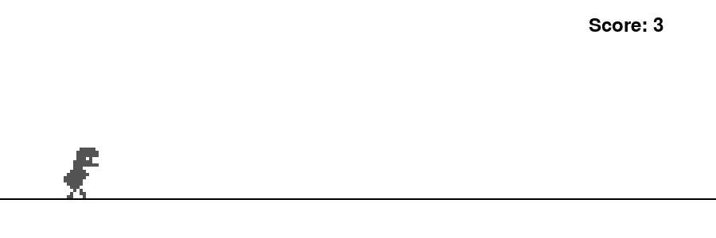

# 🦖 Dinosaur Game AI

[]( https://kasper166.github.io/DinosaurGameAI/)
[](https://share.streamlit.io)
[](https://www.python.org/)
[](https://neat-python.readthedocs.io/)
[](LICENSE)

A pixel-perfect Pygame clone of the Chrome Dinosaur game where a neural network — evolved entirely from scratch using **NEAT (NeuroEvolution of Augmenting Topologies)** — learns to survive indefinitely at any speed.



---

## 🕹️ Play the Game

You can play the game directly in your browser by clicking the "Play in Browser" button above. This version is made possible by `pygbag`, which cross-compiles the Pygame code to run in a web browser.

**Note:** The browser version only supports human play. The AI features (watching the AI play, training the AI) are only available when running the game on your desktop.

---

## 📌 Project Overview

The AI controls a dinosaur and must choose to **Run, Jump, or Duck** every frame to avoid cacti and birds flying at three different heights. Through thousands of simulated games and genetic evolution the network learns to read pixel distances and heights perfectly, clearing all obstacles at maximum game speed.

---

## Watch one entire generation play
Here is a demo of when you would run game.py
[](https://www.youtube.com/watch?v=RbqzpCAndYE)

Here is a demo of when you run replay.py I used this one to debug my code. I could see how my AI thinks.


## 🎮 Play Modes

| Key | Mode | Description |
|-----|------|-------------|
| `SPACE` | **Manual** | You play solo — real Chrome Dino difficulty curve. You can click `T` to play alongside the best genome |
| `D` | **Spectator** | Watch the entire last training generation evolve in real-time |

### Post-Game Analytics
After every game a built-in analytics screen shows:
- Your score vs the AI's all-time best and average fitness
- An inline bar chart of best/avg fitness per generation
- Which generation first surpassed your score

---

## 🧠 How the AI Works

### Neural Network — Inputs & Outputs

Each agent uses a feed-forward network evaluated every frame with **5 inputs**:

| Input | Description |
|-------|-------------|
| Distance to Obstacle | Normalized distance to the next obstacle (0.0 to 1.0) |
| Obstacle Type | 0.5 for Cactus, 1.0 for Bird |
| Obstacle Size/Height | Normalized width for cacti, or height category for birds (low/mid/high) |
| Dino Y-Position | Normalized height of the dino on the screen |
| Game Speed | Normalized current game speed |

**3 outputs:** `0` Run · `1` Jump · `2` Duck

### Training with NEAT

| Parameter | Value |
|-----------|-------|
| Population | 450 genomes / generation |
| Fitness | Frames survived (capped at 100 000) |
| Speed (training) | Starts at 7, `+1` every 500 frames |
| Speed (human play) | Starts at 6.0, `+1.0` every 200 display-score points |
| Bird spawn gate (human) | No birds until display score ≥ 10 |

**Dynamic Curriculum Learning** — mid/low birds appear early in training so the network is forced to learn ducking before it can rely on always jumping.

---

## 🚀 Running Locally

### 1 · Install

```bash
git clone https://github.com/Kasper166/DinosaurGameAI
cd DinosaurGameAI
pip install -r requirements.txt
```

### 2 · Play (human mode)

```bash
python game.py
```

Controls: `↑` / `SPACE` jump · `↓` duck · `T` toggle AI ghost · `ESC` menu

### 3 · Watch the Trained AI

```bash
python game.py    # press [W] — Watch AI
```

Or watch the full last generation (Spectator mode):

```bash
python replay.py  # F = fast mode · D = debug overlay · ESC = quit
```

### 4 · Train Your Own AI

```bash
python neat_train.py
```

A live matplotlib dashboard opens showing fitness graphs per generation.
Checkpoints are saved every 10 generations; training auto-resumes from the latest.

---

## 🌐 Web & Dashboard

### Streamlit Analytics Dashboard

```bash
streamlit run streamlit_app.py
```

Shows training progress charts, leaderboard, stats cards, and run instructions.

**Deploy free in 60 seconds:**
1. Push repo to GitHub
2. Go to [share.streamlit.io](https://share.streamlit.io) → New app
3. Select repo → `streamlit_app.py` → Deploy ✅

### Browser-Playable Build (Pygbag)

The human-play mode can be packaged for the browser with Pygbag:

```bash
pip install pygbag
python -m pygbag --build main.py     # outputs build/web/
```

> **Note:** The AI inference modes (Watch AI, Spectator) are desktop-only because
> `neat-python` and `numpy` do not have official WebAssembly wheels.

Upload `build/web/` to [itch.io](https://itch.io) as an **HTML5 project** with
*"This file will be played in the browser"* enabled.

---

## 📁 Project Structure

```
DinosaurGameAI/
├── game.py              # Core Pygame engine — all play modes + analytics screen
├── main.py              # Async Pygbag entry point (browser build)
├── neat_train.py        # NEAT training loop + live matplotlib dashboard
├── replay.py            # Full-population spectator mode (standalone)
├── streamlit_app.py     # Web analytics dashboard
├── neat_config.txt      # NEAT hyperparameters
├── best_genome.pkl      # Saved best genome
├── best_genome_meta.json# Generation + fitness metadata
├── last_generation.pkl  # Last full generation (for Spectator mode)
├── training_history.json# Per-generation stats (auto-generated by training)
├── demo.gif             # Demo animation for README / dashboard
└── requirements.txt
```

---

## 🔧 Built With

- [Python 3](https://www.python.org/)
- [Pygame](https://www.pygame.org/)
- [NEAT-Python](https://neat-python.readthedocs.io/)
- [NumPy](https://numpy.org/)
- [Matplotlib](https://matplotlib.org/)
- [Streamlit](https://streamlit.io/)
- [Altair](https://altair-viz.github.io/)

---

*Created as a portfolio piece demonstrating Reinforcement Learning principles, evolutionary algorithms, and classical control environments in Python.*
